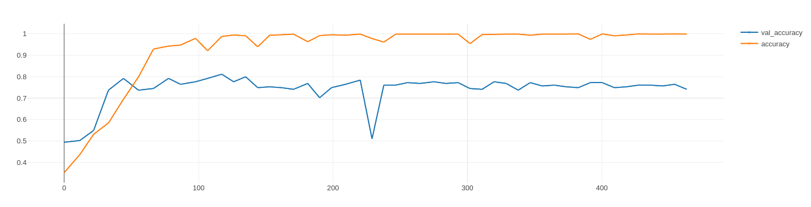

# Baseline
The baseline should be $1/(number\_of\_painters)$.

But to have an more accurate baseline, a simple one layer model was created. This was also used to test/create the environment with mlflow.
- Model

```python
inputs = keras.Input(shape=input_shape)
x = layers.Conv2D(filters=32, kernel_size=3, activation="relu")(inputs)
x = layers.MaxPooling2D(pool_size=2)(x)
x = layers.Dropout(0.5)(x)

x = layers.Flatten()(x)
x = layers.Dense(256, activation="relu")(x)
outputs = layers.Dense(output_shape, activation="softmax")(x)
```
- Metrics logged with mlflow


