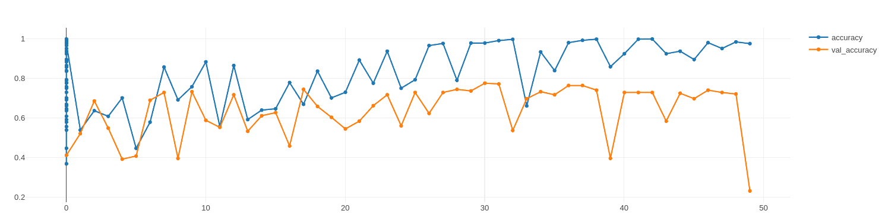

# More complexity
## Summary
| Model    | Train_acc | Val_acc | Test_acc | Training Time (in minutes) |
| :------- | :-------- | :------ | :------- | :------------------------- |
| Baseline | 0.999     | 0.929   | 0.965    | 3.6                        |


## Baseline
- best model of conv base

```python
conv_base = keras.applications.vgg19.VGG19(
            weights="imagenet",
            include_top=False
            )

conv_base.trainable = True
for layer in conv_base.layers[:-2]:
    layer.trainable = False


inputs = keras.Input(shape=input_shape)
x = inputs
x = keras.applications.vgg19.preprocess_input(x)
x = conv_base(x)

x = layers.Flatten()(x)
x = layers.Dense(256, activation="relu")(x)
x = layers.Dropout(0.5)(x)
outputs = layers.Dense(output_shape, activation="softmax")(x)
model = keras.Model(inputs=inputs, outputs=outputs)
model.compile(loss="categorical_crossentropy",optimizer="rmsprop",metrics=["accuracy"])
```

## Other models tried
- This adds more layers on top of the baseline
- 
| Model                 | Train_acc | Val_acc | Test_acc | Training Time (in minutes) |
| :-------------------- | :-------- | :------ | :------- | :------------------------- |
| Conv_layers_model_001 | 0.365     | 0.392   | 0.392    | 3.8                        |
| Concatinate_model_001 | 1         | 0.706   | 0.725    | 3.4                        |
| Concatinate_model_002 | 1         | 0.765   | 0.78     | 3.4                        |
| Concatinate_model_003 | 0.976     | 0.231   | 0.227    | 3.0                        |


### Conv2D layers model 1
- This model added 1 extra layer after the conv base
- This doesn't learn anymore

```python
conv_base = keras.applications.vgg19.VGG19(
            weights="imagenet",
            include_top=False
            )

conv_base.trainable = True
for layer in conv_base.layers[:-2]:
    layer.trainable = False


inputs = keras.Input(shape=input_shape)
x = inputs
x = keras.applications.vgg19.preprocess_input(x)
x = conv_base(x)

x = layers.Conv2D(filters=32, kernel_size=3, activation="relu")(x)
x = layers.MaxPooling2D(pool_size=2)(x)

x = layers.Flatten()(x)
x = layers.Dense(256, activation="relu")(x)
x = layers.Dropout(0.5)(x)
outputs = layers.Dense(output_shape, activation="softmax")(x)
model = keras.Model(inputs=inputs, outputs=outputs)
model.compile(loss="categorical_crossentropy",optimizer="rmsprop",metrics=["accuracy"])
```


### Concatinate model 001
- Tried to see if concatinating models would work
- Results were a bit better then the first baseline model but a lot worse than any conv base that trained

```python
inputs = keras.Input(shape=input_shape)
tower_1 = layers.Conv2D(filters=32, kernel_size=3, activation="relu")(inputs)
tower_1 = layers.MaxPooling2D(pool_size=2)(tower_1)

tower_2 = layers.Conv2D(filters=32, kernel_size=3, activation="relu")(inputs)
tower_2 = layers.MaxPooling2D(pool_size=2)(tower_2)

tower_3 = layers.Conv2D(filters=32, kernel_size=3, activation="relu")(inputs)
tower_3 = layers.MaxPooling2D(pool_size=2)(tower_3)

        
x = keras.layers.concatenate([tower_1, tower_2, tower_3], axis=1)
x = layers.Flatten()(x)

x = layers.Dense(256, activation='relu')(x)

outputs = layers.Dense(output_shape, activation="softmax")(x)
model = keras.Model(inputs=inputs, outputs=outputs)
model.compile(loss="categorical_crossentropy",optimizer="rmsprop",metrics=["accuracy"])
```


### Concatinate model 002
- This added another layer to the towers
- Results were a better than the first Concatinate model

```python
inputs = keras.Input(shape=input_shape)
towers = []
num_of_towers = 3
for i in range(num_of_towers):

    tower = layers.Conv2D(filters=32, kernel_size=3, activation="relu")(inputs)
    tower = layers.MaxPooling2D(pool_size=2)(tower)
    tower = layers.Conv2D(filters=64, kernel_size=3, activation="relu")(tower)
    tower = layers.MaxPooling2D(pool_size=2)(tower)
    
    towers.append(tower)

        
x = keras.layers.concatenate(towers, axis=1)
x = layers.Flatten()(x)

x = layers.Dense(256, activation='relu')(x)

outputs = layers.Dense(output_shape, activation="softmax")(x)
model = keras.Model(inputs=inputs, outputs=outputs)
model.compile(loss="categorical_crossentropy",optimizer="rmsprop",metrics=["accuracy"])
```


### Concatinate model 003

- This added another layer to the towers
- Results were a better than the first Concatinate model

```python
inputs = keras.Input(shape=input_shape)
towers = []
num_of_towers = 3
for i in range(num_of_towers):

    tower = layers.Conv2D(filters=32, kernel_size=3, activation="relu")(inputs)
    tower = layers.MaxPooling2D(pool_size=2)(tower)
    tower = layers.Conv2D(filters=64, kernel_size=3, activation="relu")(tower)
    tower = layers.MaxPooling2D(pool_size=2)(tower)
    tower = layers.Conv2D(filters=128, kernel_size=3, activation="relu")(tower)
    tower = layers.MaxPooling2D(pool_size=2)(tower)
    
    towers.append(tower)

        
x = keras.layers.concatenate(towers, axis=1)
x = layers.Flatten()(x)

x = layers.Dense(256, activation='relu')(x)

outputs = layers.Dense(output_shape, activation="softmax")(x)
model = keras.Model(inputs=inputs, outputs=outputs)
model.compile(loss="categorical_crossentropy",optimizer="rmsprop",metrics=["accuracy"])
```



