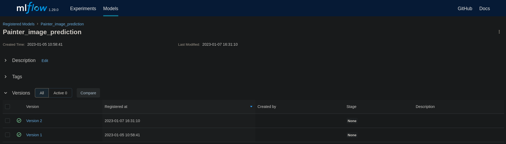
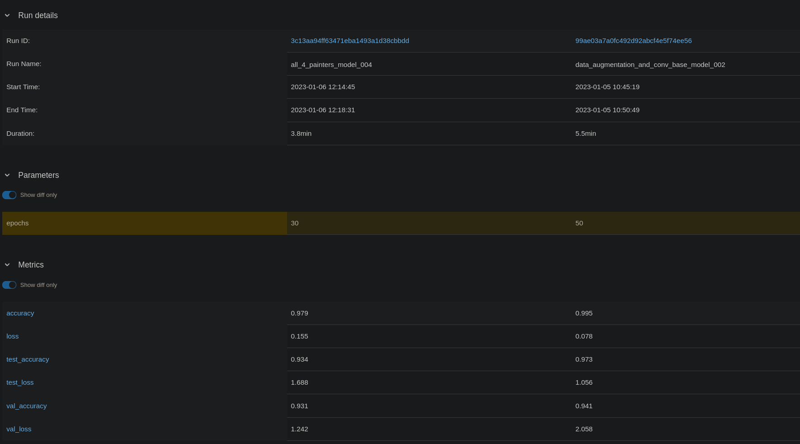
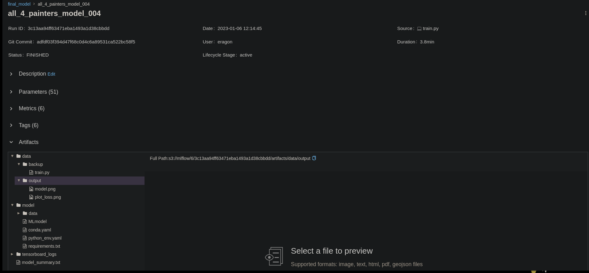

# Creating environment
## Tools used

- MLFlow
- Conda
### Conda
- Conda is used to create the environment and make sure it works across devices
### MLflow

#### Why mlflow
Mlflow was used to manage the models and keep note of what changes were made to the model and what effect that had on the metrics/result of the model.
In mlflow we have experiments. These are used to organize runs in categories. 

Mlflow also give the option to host the models. This can be used to manage what model version is active at each moment.

Mlflow was also used to compare models agains each other.

#### Artifacts
- Mlflow also logs the artifacts of each run 
- With mlflow_helpers and the class `Mlflow_controller` 
  - the `train.py` is logged to mlflow
    - This makes it possible to see exact what code is used to make the model
    - And removes the chances of losing what change affected the metrics
  - With the artifacts there are also all files required to deploy the model on another server
    - Using conda or virtual environments

#### Deploying mlflow
- The docker compose file was used to deploy mlflow server
  - Because this also deployes Minio and the SQL database
    - Minio and the database are used to manage the artifacts and the models (the deployed models)
  - Normaly to deploy an model from mlflow `mlflow models serve` command is used
    - Here the website downloaded the model and predicts it.
    - The website should normaly send the data to the server that runs the model
    - But that was outside of the material seen in the class

#### mlflow_Controller

- This [class](../helpers/mlflow_helpers.py) was created to manage the runs in mlflow
- Sequence of the used classes
1. load_features()
2. _set_train_options()
3. _build_model()
4. train()
5. mlflow_log()

- The class has been documented for more explanation on the working
- This simplified the used of mlflow and the train.py file was cleaner and easier to understand

