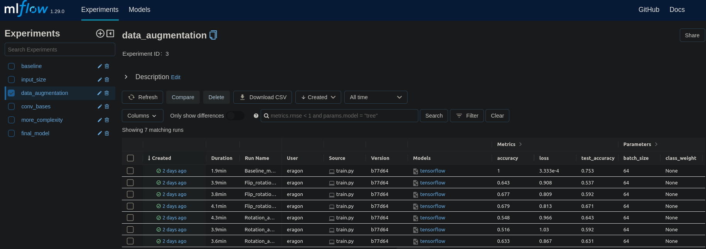

# Creating environment
## Tools used

- MLFlow
- Conda

### MLflow

#### Terms

| Term        | Explination                                                                                       |
| :---------- | :------------------------------------------------------------------------------------------------ |
| Experiments | Experiments are used to rganize runs in categories. Where each categories represent an experiment |
|   Runs          |                                                                                                   |

Mlflow was used to manage the models and keep note of what changes were made to the model and what effect that had on the metrics/result of the model.
In mlflow we have experiments. These are used to organize runs in categories. 
