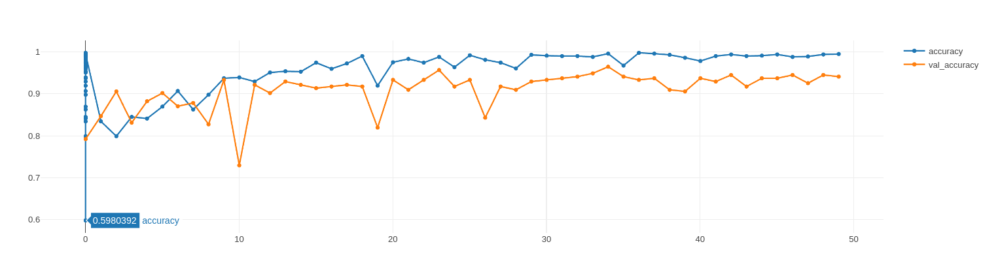
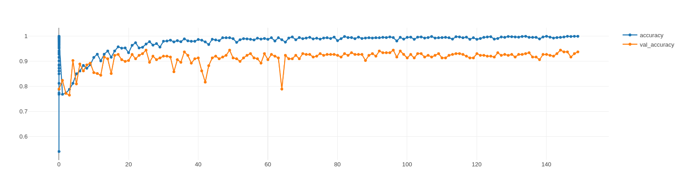
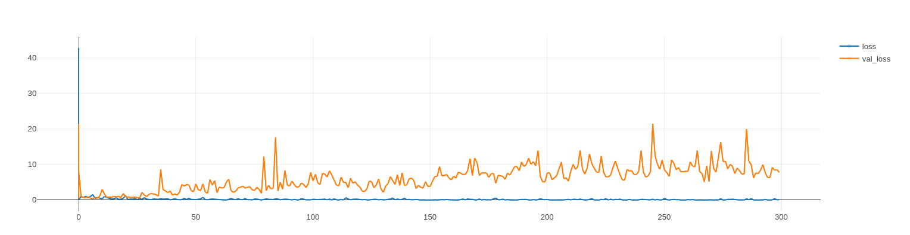
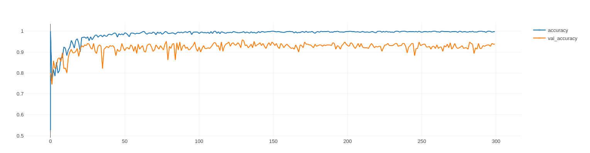
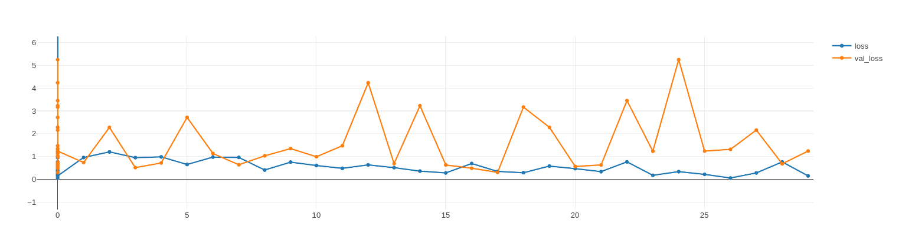

# Final model
## 3 painters
- The final models uses
  - 180 x 180 as image size
  - Flip, rotation_and_zoom (horizontal, 0.1, 0.2) 
  - VGG19 2 trainable layers as conv base
final_model_3_painters_accuracy
this gave the best metrics.

| Model                       | Train_acc | Val_acc | Test_acc | Training Time (in minutes) |
| :-------------------------- | :-------- | :------ | :------- | :------------------------- |
| Final model with 3 painters | 0.995     | 0.941   | 0.973    | 5.5                        |
| Final model with 4 painters | 0.979     | 0.931   | 0.934    | 3.8                       |



```python
data_augmentation = keras.Sequential([
    layers.RandomFlip("horizontal"),
    layers.RandomRotation(0.1),
    layers.RandomZoom(0.2),
    ])

conv_base = keras.applications.vgg19.VGG19(
            weights="imagenet",
            include_top=False
            )

conv_base.trainable = True
for layer in conv_base.layers[:-2]:
    layer.trainable = False


inputs = keras.Input(shape=input_shape)
x = inputs
x = data_augmentation(x) 

x = keras.applications.vgg19.preprocess_input(x)
x = conv_base(x)

x = layers.Flatten()(x)
x = layers.Dense(256, activation="relu")(x)
x = layers.Dropout(0.5)(x)
outputs = layers.Dense(output_shape, activation="softmax")(x)
model = keras.Model(inputs=inputs, outputs=outputs)
model.compile(loss="categorical_crossentropy",optimizer="rmsprop",metrics=["accuracy"])
```

## 4 Painters

- 3 painters gave an nice result so the painter that was scraped was added
- This also gave an nice result but didn't make the 95% accuracy on the test dataset





- Then a run with 300 epochs was started
  - This because even at 100 epochs there didn't seemed to be overfitting
  - When looking at this afterwards I looked at accuracy but should haved looked at the loss to detect overfitting




- Because even at 300 epochs the validation accuracy didn't realy drop I looked it up
- Now I found out I should have looked at loss to see when there is overfitting
- And restarted the training with 30 epochs





- the model didn't change for these final steps
- The test accuracy is just below 95%, but because 95% was already reached with 3 painters
  - there were no more improvements

```python
data_augmentation = keras.Sequential([
            layers.RandomFlip("horizontal"),
            layers.RandomRotation(0.1),
            layers.RandomZoom(0.2),
            ])
        
        conv_base = keras.applications.vgg19.VGG19(
                    weights="imagenet",
                    include_top=False
                    )
        
        conv_base.trainable = True
        for layer in conv_base.layers[:-2]:
            layer.trainable = False

    
        inputs = keras.Input(shape=input_shape)
        x = inputs
        x = data_augmentation(x) 
        
        x = keras.applications.vgg19.preprocess_input(x)
        x = conv_base(x)
        
        x = layers.Flatten()(x)
        x = layers.Dense(256, activation="relu")(x)
        x = layers.Dropout(0.5)(x)
        outputs = layers.Dense(output_shape, activation="softmax")(x)
        model = keras.Model(inputs=inputs, outputs=outputs)
        model.compile(loss="categorical_crossentropy",optimizer="rmsprop",metrics=["accuracy"])
```