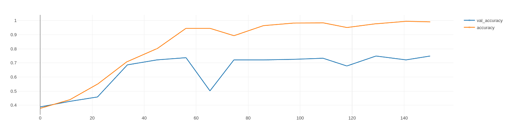

# Input size
## Summary

| Model                | Train_acc | Val_acc | Test_acc | Training Time (in minutes) |
| :------------------- | :-------- | :------ | :------- | :------------------------- |
| Baseline             | 0.991     | 0.749   | 0.733    | 6.7                        |
| Increased image size | 0.929     | 0.71    | 0.725    | 13.3                       |
| Decreased image size | 0.385     | 0.392   | 0.392    | 13.2                       |

- We will use 180 x 180 shape for now
  - For the faster training speed
  - But will check if we added some more complexity to the model what the image shape will do then

## 180 x 180 (baseline)
- This is the baseline for this example.
- 15 epochs to speed up the testing

## 400 x 400 (increased image size)
- Increased image size
- Takes a lot longer to train

## 60 x 50 (decreased image size)
- Increased image size
- We can see it doesn't train
- We need to reduce the Trainable params or increase the input shape

